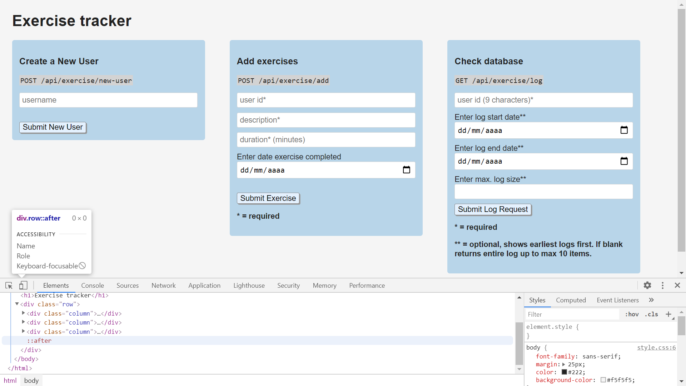
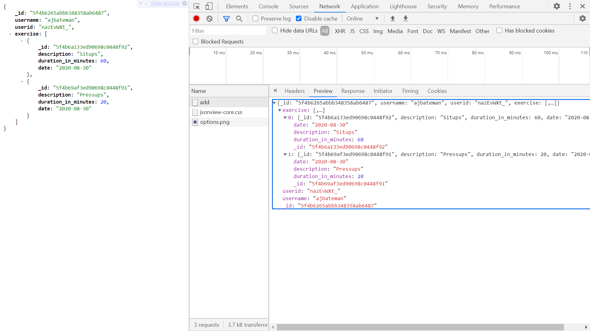
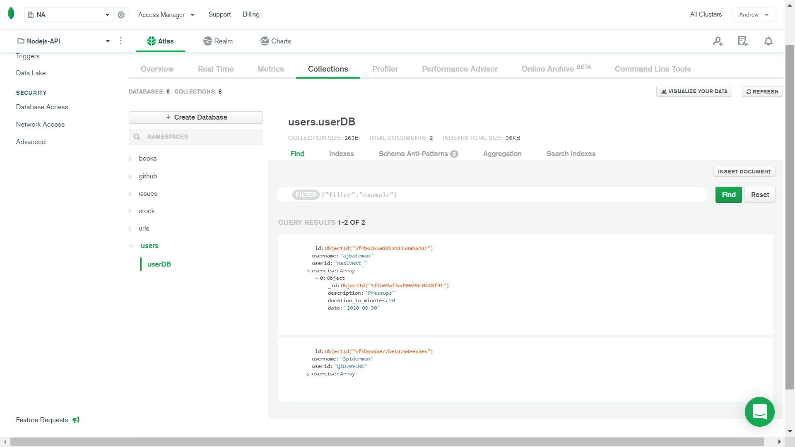

# :zap: Exercise Tracker REST API

* Stores user name, id and exercise array as a MongoDB JSON object
* This was a microservice project for the FreeCodeCamp Front End Certification. User stories are mostly the same for the current FCC project.
* Note: mLab MongoDB Heroku add-on has been shut down - suggest MongoDB Atlas (free tier) is used instead
* **Note:** to open web links in a new window use: _ctrl+click on link_


## :page_facing_up: Table of contents

* [:zap: Exercise Tracker REST API](#zap-exercise-tracker-rest-api)
  * [:page_facing_up: Table of contents](#page_facing_up-table-of-contents)
  * [:books: General info](#books-general-info)
  * [:camera: Screenshots](#camera-screenshots)
  * [:signal_strength: Technologies](#signal_strength-technologies)
  * [:floppy_disk: Setup](#floppy_disk-setup)
  * [:computer: Code Examples](#computer-code-examples)
  * [:cool: Features](#cool-features)
  * [:clipboard: Status & To-Do List](#clipboard-status--to-do-list)
  * [:clap: Inspiration](#clap-inspiration)
  * [:envelope: Contact](#envelope-contact)

## :books: General info

* Some Original instructions (User Stories) from FCC:

1. I can provide my own project, not the example URL.
2. I can create a user by posting form data username to /api/exercise/new-user and returned will be an object with username and _id.
3. I can add an exercise to any user by posting form data userId(_id), description, duration, and optionally date to /api/exercise/add. If no date supplied it will use current date. App will return the user object with the exercise fields added.
4. I can retrieve a full exercise log of any user by getting /api/exercise/log with a parameter of userId(_id). App will return the user object with added array log and count (total exercise count).
5. I can retrieve part of the log of any user by also passing along optional parameters of from & to or limit. (Date format yyyy-mm-dd, limit = int)

* [mongoose findOne](https://mongoosejs.com/docs/api.html#model_Model.findOne) used to check if username exists in database before adding new user object
* [JavaScript Array unshift() Method](https://www.w3schools.com/jsref/jsref_unshift.asp#:~:text=The%20unshift()%20method%20adds,use%20the%20push()%20method.) used to add new user exercise data to begining of user exercise array

## :camera: Screenshots

.
.
.

## :signal_strength: Technologies

* [Node v12](https://nodejs.org/en/) javaScript runtime built on Chrome's V8 JavaScript engine
* [Express v5](https://expressjs.com/) Fast, unopinionated, minimalist web framework for Node.js
* [body-parser v1](https://www.npmjs.com/package/body-parser) to parse incoming request bodies in middleware before handlers
* [Cors v2](https://www.npmjs.com/package/cors) node.js package for providing Connect/Express middleware that can be used to enable CORS with various options.

## :floppy_disk: Setup

* Create MongoDB Atlas Cloud database (or local installed MongoDB database) and add user access/database credentials (USER_NAME, USER_PASSWORD, DB_CLUSTER, PORT, DB_NAME & SESSION_SECRET) to a new `.env` file. These are used in `server.js`.
* Add your IP address to MongoDB Atlas Network Access whitelist. Or simply whitelist all (IP address 0.0.0.0/0).
* Run `npm run start` or `node server.js` for a dev server.
* Navigate to `http://localhost:4000/` (or other port selected/default port 3000) for home screen.
* The app will not automatically reload if you change any of the source files.

## :computer: Code Examples

* extract from `server.js` to POST exercise array to database by finding user using userid

```javascript
    // Array unshift method used to add new item to beginning of exercise array
    // current date added as default if no user date input
		app.post('/api/exercise/add', (req, res) => {
			const user = req.body.userId;
			userInfo.findOne({ userid: user }, (err, user) => {
				console.log(user);
				if (err) throw err;
				user.exercise.unshift({
					description: req.body.description,
					duration_in_minutes: req.body.duration,
					date: req.body.date ? req.body.date : moment().format('YYYY-MM-DD'),
				});
				res.json(user); //send back json object
			});
		});
```

## :cool: Features

* MongoDB Atlas Cloud database is easy to setup and use

## :clipboard: Status & To-Do List

* Status: Working
* To-Do: could be refactored to separate routes and controllers

## :clap: Inspiration

* [freeCodeCamp's APIs and Microservices Projects - Timestamp Microservice](https://www.freecodecamp.org/learn/apis-and-microservices/apis-and-microservices-projects/exercise-tracker)
* [FullStackTraining: res.json() vs res.send() vs res.end() in Express](https://blog.fullstacktraining.com/res-json-vs-res-send-vs-res-end-in-express/)
## :file_folder: License

* This project is licensed under the terms of the MIT license.

## :envelope: Contact

* Repo created by [ABateman](https://github.com/AndrewJBateman), email: gomezbateman@yahoo.com
